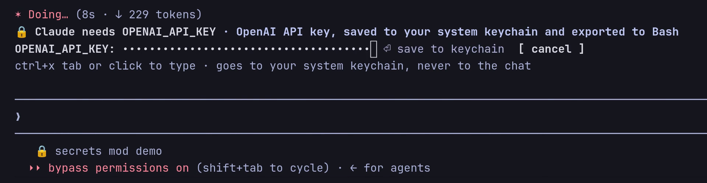

# secrets: stop pasting API keys into Claude Code

A Claude Code mod. When Claude needs a key, it asks in a **masked field above your prompt**. The key goes to your **OS keychain**, every Bash command gets it as `$NAME`, and if it ever shows up in command output Claude sees `[secret:NAME]` instead.

[](media/demo.mp4)

▶ [Watch the 30 s demo](media/demo.mp4)

## Install

At the prompt of a Claude Code session:

```
/plugin install secrets --marketplace falkoro/claude-code-secrets
```

Answer `y` to add the marketplace, then pick a scope.

## Use

- **Let Claude ask.** Say "use my OpenAI key". Claude calls `ask_secret`, and the field appears above your prompt. Press **ctrl+x tab** (or click it), paste, press Enter.
- **Or add one yourself:** `/secret OPENAI_API_KEY`. Plain `/secret` lists the saved names.

From then on, every Bash command Claude runs starts with `export OPENAI_API_KEY="$(<keychain lookup>)"`. The key never appears in the chat, the transcript, the tool call or the command line.

## Where keys go

| OS | Store | Remove a key |
| --- | --- | --- |
| macOS | login Keychain, service `claude-code` | `security delete-generic-password -s claude-code -a NAME` |
| Linux | Secret Service (GNOME Keyring, KWallet) via `secret-tool` (`libsecret-tools` on Debian/Ubuntu, `libsecret` on Arch) | `secret-tool clear service claude-code name NAME` |
| Windows | `%APPDATA%\claude-code\secrets\NAME`, encrypted with DPAPI to your Windows login | delete the file |

## Limits

- Redaction covers **Bash output only**. If Claude reads a `.env` file with Read, it still sees the key, and a transformed key (base64, say) isn't caught.
- Claude Code's text field has no mask option yet, so each keystroke shows for about 15 ms before it becomes a bullet.
- A mod can't take the keyboard by itself: the field takes keys after **ctrl+x tab** or a click.
- I've tested it live on Linux. The macOS and Windows paths are covered by unit tests only so far; issues and PRs welcome.
- It needs a Claude Code build with mods (function hooks). Built on 2.1.292.

Want this built into Claude Code? 👍 [anthropics/claude-code#29910](https://github.com/anthropics/claude-code/issues/29910).

## Develop

```
claude --plugin-dir .         # run it from this folder
claude plugin validate .
claude plugin test .
```

MIT licensed.
